# Plataforma Fiscal DFe

Plataforma SaaS para receber, organizar e consultar documentos fiscais eletrônicos, com aplicação web em Laravel, banco de dados MySQL, API de integração e demonstração de envio em Delphi.

## Principais recursos

- Ambiente multiempresa.
- Envio de XML de NFe, NFCe, SAT, CTe e MDFe para a plataforma.
- Controle de documentos autorizados, cancelados, inutilizados e cartas de correção.
- Pesquisa, filtros, relatórios e download de documentos.
- API para integração com sistemas externos.
- Projeto de demonstração em Delphi.

## Tecnologias

- Laravel 8, PHP 7.3 ou 8.0 e Livewire.
- MySQL.
- Delphi para o exemplo de integração.

## Instalação da aplicação web

1. Entre no diretório `src`.
2. Execute `composer install`.
3. Copie `.env.example` para `.env`.
4. Configure o banco de dados e defina uma chave forte em `DFE_API_KEY`.
5. Execute `php artisan key:generate`.
6. Execute `php artisan migrate`.
7. Se desejar criar o administrador inicial, preencha `SEED_ADMIN_EMAIL` e `SEED_ADMIN_PASSWORD` antes de executar o seeder.
8. Execute `php artisan storage:link` e configure o servidor web.

## Demonstração Delphi

O diretório `demodelphi` contém um exemplo de integração. Configure as URLs no arquivo `Config.ini` e substitua os valores de exemplo pela chave definida em `DFE_API_KEY` antes de testar os envios.

## Segurança

O repositório não inclui arquivo `.env`, certificados, documentos fiscais reais, sessões, logs ou dependências instaladas. Use credenciais próprias e nunca publique chaves de produção.

## Imagens

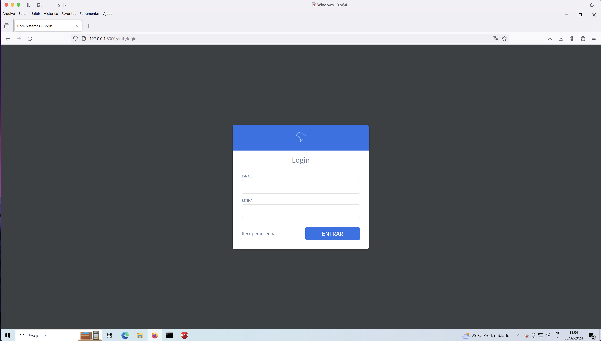

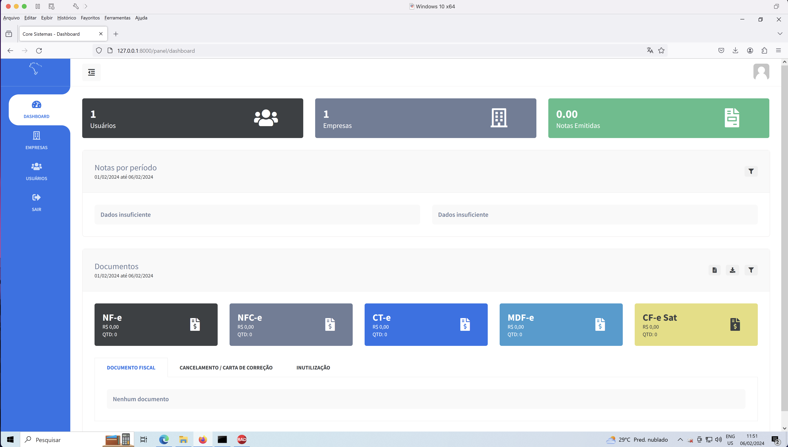

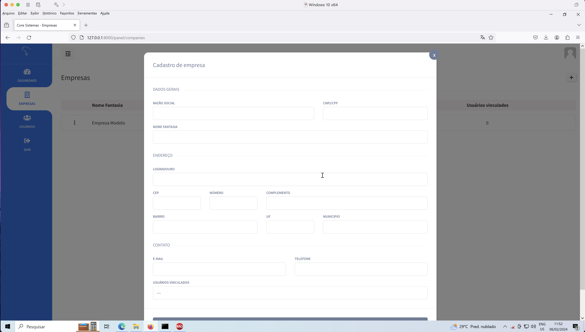

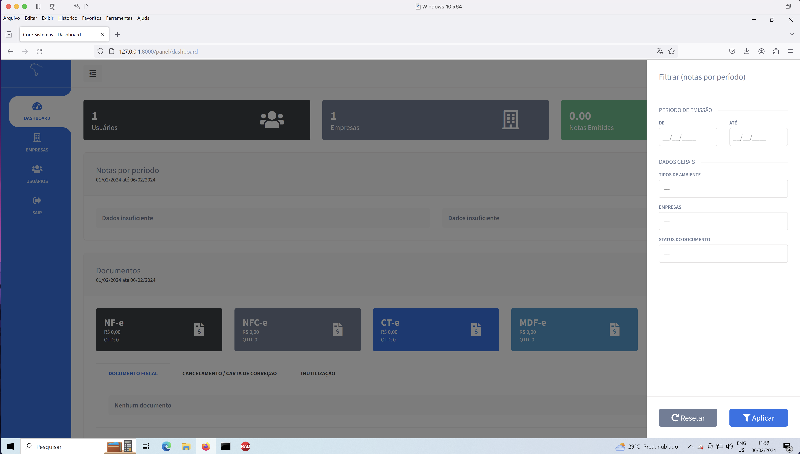

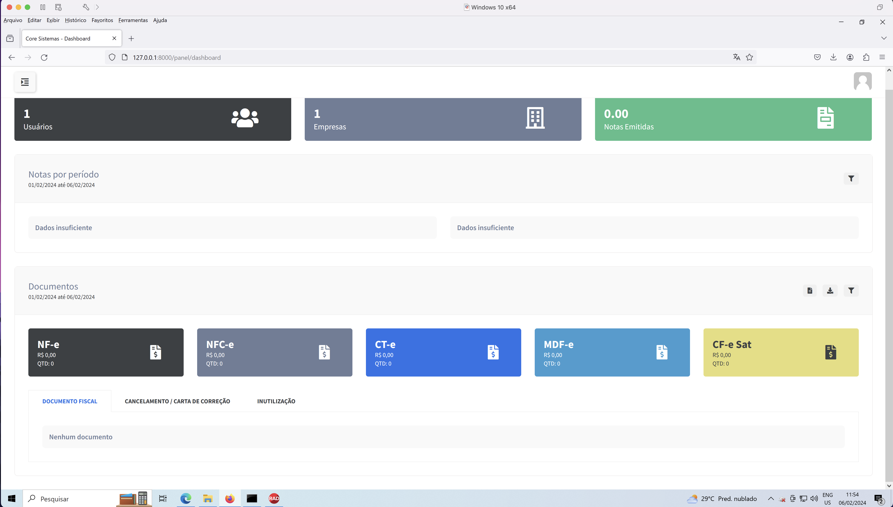

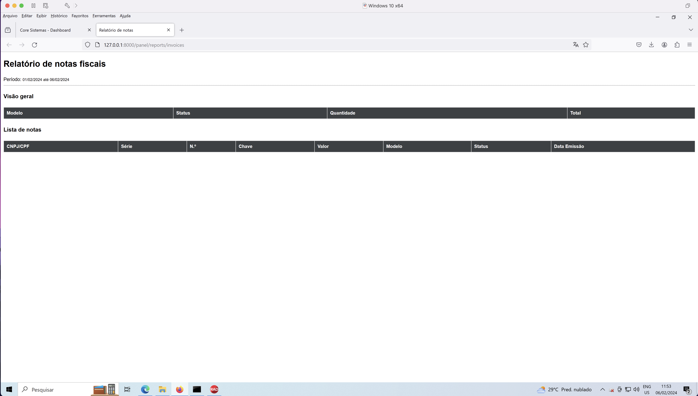

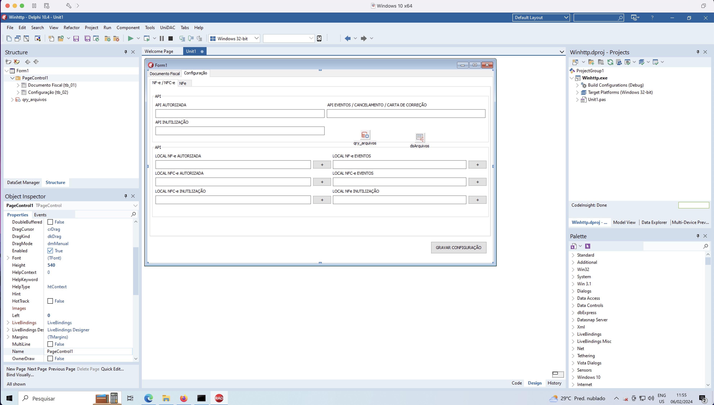

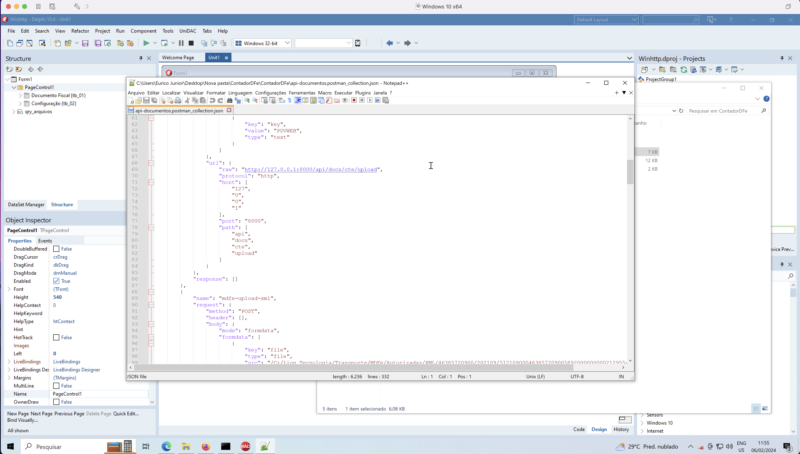

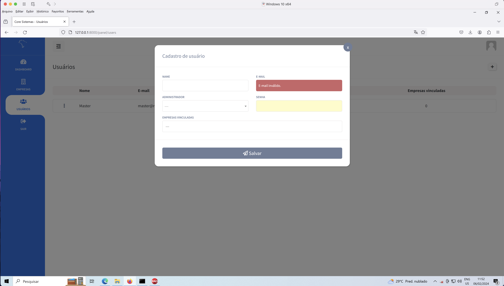

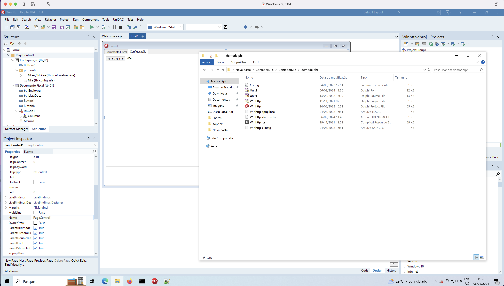

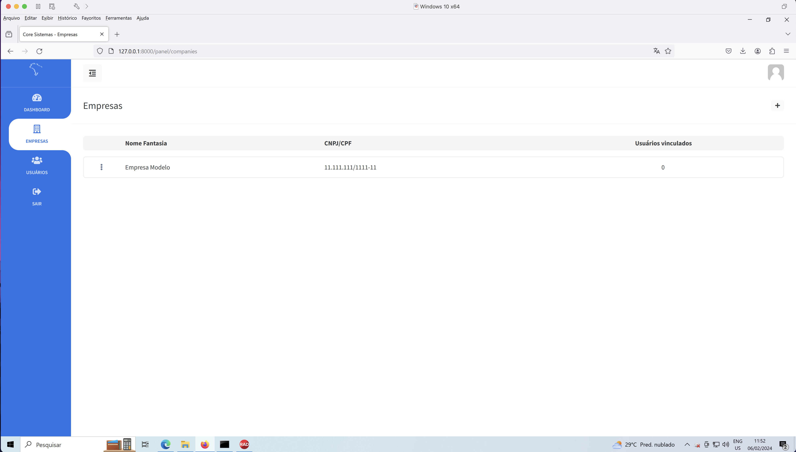

